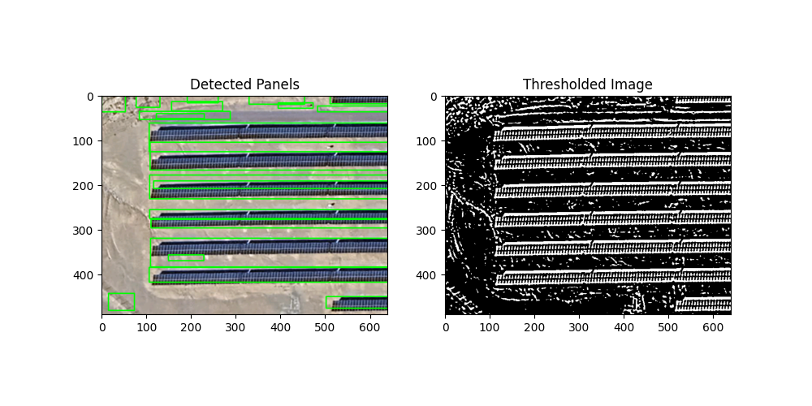

# Processing pipeline

Still a work in progress, but the current pipeline is
- Use color segmentation with a color close to that of the panel, the use tresholding to isolate the panels and get a binary image
- Then sample the regions within the seed point for color region growing.
- This should outline the rough area of the panels, morphological dialation can be use to give some padding to the region.

Current rough result:

### Note
Stitch together images from google maps using https://github.com/OpenStitching/stitching 